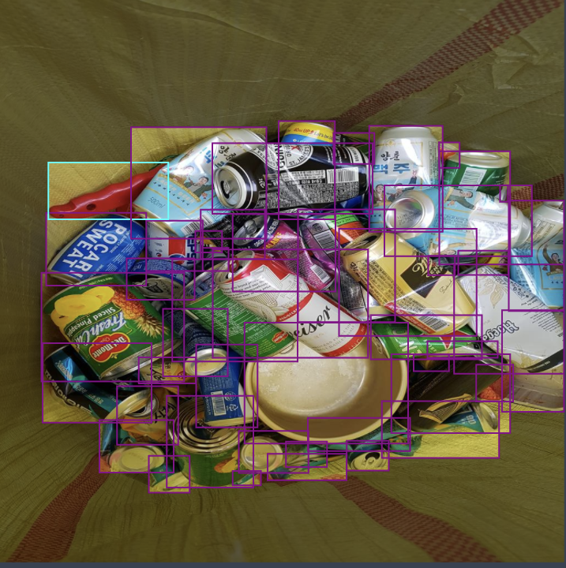
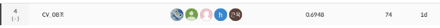

# Boostcamp-AI-Tech-Level1-BE1
<!-- ALL-CONTRIBUTORS-BADGE:START - Do not remove or modify this section -->

<!-- ALL-CONTRIBUTORS-BADGE:END -->

- [부스트캠프 AI Tech](https://boostcamp.connect.or.kr/program_ai.html) - Level2. Object Detection Competition  

# Introduction

이미지에서 쓰레기를 Detection하는 프로젝트로 총 10가지 종류 쓰레기를 구분하고, 동시에 쓰레기의 위치를 Detection하는 프로젝트이다. 잘 분리배출 된 쓰레기는 자원으로서 가치를 인정받아 재활용되지만, 잘못 분리배출 되면 그대로 폐기물로 분류되어 매립 또는 소각되기 때문에 분리수거는 환경 부담을 줄일 수 있는 방법 중 하나이다.

따라서 우리는 사진에서 쓰레기를 Detection 하는 모델을 만들어 이러한 문제점을 해결해보고자 하고, 이 프로젝트를 통해 여러가지 object detection과 관련된 tool과 model에 대한 이해를 넓이고자 하였다.

 

# 프로젝트 팀 구성 및 역할

|이름|역할|
|:---:|:---:|
|강나훈|EDA, Data re-labeling and cleaning, Loss, Neck 실험, Test time Threshold 실험
|김근욱|Ensemble code, Learning Rate, Augmentation, Multi Scale, FPN, TTA|
|김희상|Pytorch template 분석, 여러가지 모델 코드 분석, Sample code migration|
|이종목|Data augmentation(HueSaturation, CLAHE, emboss 등), Focal Loss, Pseudo Labeling, Multiscale Training|
|정성혜|Data augmentation (Mosaic, Mixup), Fine-tuning with augmented data|
|공통|Model research, Wrap Up report 작성, 검증용 데이터 구성, backbone 실험, Ensemble 실험|

 

# 프로젝트 수행 절차
1. 프로젝트 개발환경 구축(Github, VSCode, MMDetection, PyTorch)
2. EDA를 통한 데이터 파악 및 통계치 계산 
3. StratifiedGroupKFold를 이용한 CV strategy 결정
4. MMDetection용 baseline 모델 실험
5. baseline 모델에서 높은 성능을 내는 backbone 실험
6. neck 실험
7. EDA 결과를 이용한 Data cleaning 
8. 학습데이터 re-labeling
9. Data augmentation및 TTA 실험
10. Loss, hyperparameter 조정
11. WBF Ensemble

 

# 프로젝스 수행 결과

Public/Private 테스트셋에 대한 mAP50로 평가하였다. Public mAP50는 0.6948, private mAP50는 0.6827로 최종 리더보드에서 19팀 중 4위로 프로젝트를 마무리하였다

- public score

- private score
  

 

---

 

## requirements
- OS : Linux,
- GPU : Tesla V100
- mmdetection : 2.25.3
- CUDA : 11.0
- python : 3.9.12
- torch : 1.7.1
- torchvision : 0.8.2
- opencv-python==4.7.0.72
- numpy==1.24.2

 

----
## 협업 규칙

- 커밋 메시지 컨벤션은 [conventional commit](https://www.conventionalcommits.org/en/v1.0.0/)을 따릅니다 
  - [commitizen](https://github.com/commitizen-tools/commitizen)을 사용하면 더욱 쉽게 커밋할 수 있습니다
- 작업은 기본적으로 별도의 브랜치를 생성하여 작업합니다. 작업이 완료되면 PR로 리뷰 받습니다
- PR 리뷰 후 머지 방식은 Squash & Merge를 따릅니다
  - Merge 전에 PR 제목을 되도록이면 convetional commit 형태로 만들어주세요

 

## Contributors ?

Thanks goes to these wonderful people ([emoji key](https://allcontributors.org/docs/en/emoji-key)):

<!-- ALL-CONTRIBUTORS-LIST:START - Do not remove or modify this section -->
<!-- prettier-ignore-start -->
<!-- markdownlint-disable -->
<table>
  <tr>
    <td align="center"><a href="https://github.com/ejrtks1020"> <b>강나훈</b></a> <a href="https://github.com/ejrtks1020" title="Code"></td>
    <td align="center"><a href="https://github.com/lijm1358"> <b>이종목</b></a> <a href="https://github.com/lijm1358" title="Code"></td>
    <td align="center"><a href="https://github.com/fneaplle"> <b>김희상</b></a> <a href="https://github.com/fneaplle" title="Code"></td>
    <td align="center"><a href="https://github.com/KimGeunUk"> <b>김근욱</b></a> <a href="https://github.com/KimGeunUk" title="Code"></td>
    <td align="center"><a href="https://github.com/jshye"> <b>정성혜</b></a> <a href="https://github.com/jshye" title="Code"></td>    
  </tr>
</table>

<!-- markdownlint-restore -->
<!-- prettier-ignore-end -->

<!-- ALL-CONTRIBUTORS-LIST:END -->

This project follows the [all-contributors](https://github.com/all-contributors/all-contributors) specification. Contributions of any kind welcome!
